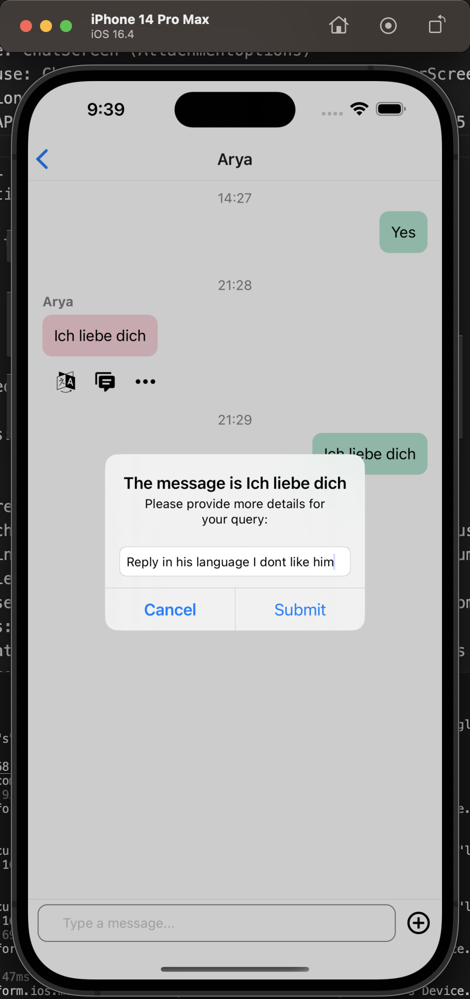
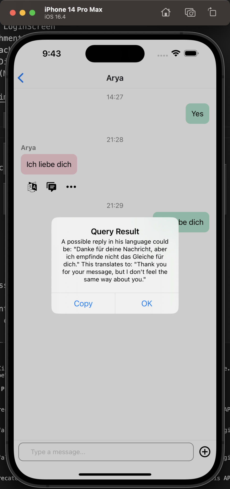

Contribution

SignUpScreen and LoginScreen are modified from instructor's Github

Yucheng Wang: ChatScreen, ChatsScreen, FriendsScreen, SearchScreen, Firebase and OpenAI setup

Xiangyuan Ding: DiscoverScreen, ProfileScreen, CreatePost, ProfileScreen, access management

Authentication: SignupScreen, LoginScreen

Camera use: ChatScreen (AttachmentOptions)

Location use: ChatScreen (AttachmentOptions), DiscoverScreen

Notification: ProfileScreen (Discover Reminder)

External API use: ChatScreen (MessageActions): ChatGPT 3.5 Turbo API

Data Model

1. Collections:

There are three primary collections:

- chats
- posts
- users

2. Detailed Description:

  i. chats:

- Purpose: Stores all chat sessions.
- Structure:
  - Each chat session represents a chat room between two users.
  - Contains a sub-collection called "messages" and a document.
- Sub-collection: messages:
  - Purpose: Stores all messages exchanged in the chat room.
  - Fields:
    - createdAt: Timestamp indicating when the message was created.
    - text: The content of the message.
    - userId: The ID of the user who sent the message.
- Document:
  - Purpose: Provides meta-information about the chat room.
  - Fields:
    - deleteBy: Indicates which user (if any) has deleted this chat on their device.
    - lastMessage: The last message exchanged in this chat room.
    - lastMessageTime: Timestamp indicating when the last message was sent.
    - members: A list containing the IDs of the two users in the chat.
    - pinnedUsers: A containing the IDs of the users who pinned the chat.

 ii. posts:

- Purpose: Stores all the posts created by users.
- Fields:
  - title: The title of the post.
  - gps: The geographical location where the post was created.
  - description: The content or description of the post.
  - photoList: All photos links in this post.
  - authorId: The id of the author

 iii. users:

- Purpose: Stores information related to all registered users.
- Fields:
  - email: The email ID of the user.
  - friends: A list containing the IDs of the user's friends.
  - name: The name of the user.
  - avatar: The avatar of the user

3. Relationships:

1. Each user can be a part of multiple chat sessions in the chats collection.
2. Each user can have multiple posts in the posts collection.
3. The userId in the chats collection's messages links back to a document in the users collection, indicating which user sent the message.
4. The friends list in the users collection might link to other user documents, establishing a network of connections between users.

This data model allows for efficient querying and retrieval of chat sessions, individual messages, user posts, and user details. It supports the core features of a chat application while providing flexibility for future enhancements.

Installations:
npm install --save react-native-swipeout   
npm install --save react-native-swipe-list-view
npm install --save expo install expo-notifications
npm install --save expo-image-picker
npm install --save expo-location
npm install --save @firebase/storage
npm install --save react-native-maps
npm install --save openai
npm install --save expo-clipboard
npx expo install expo-clipboard@~4.1.2
npm install --save react-native-dialog-input
